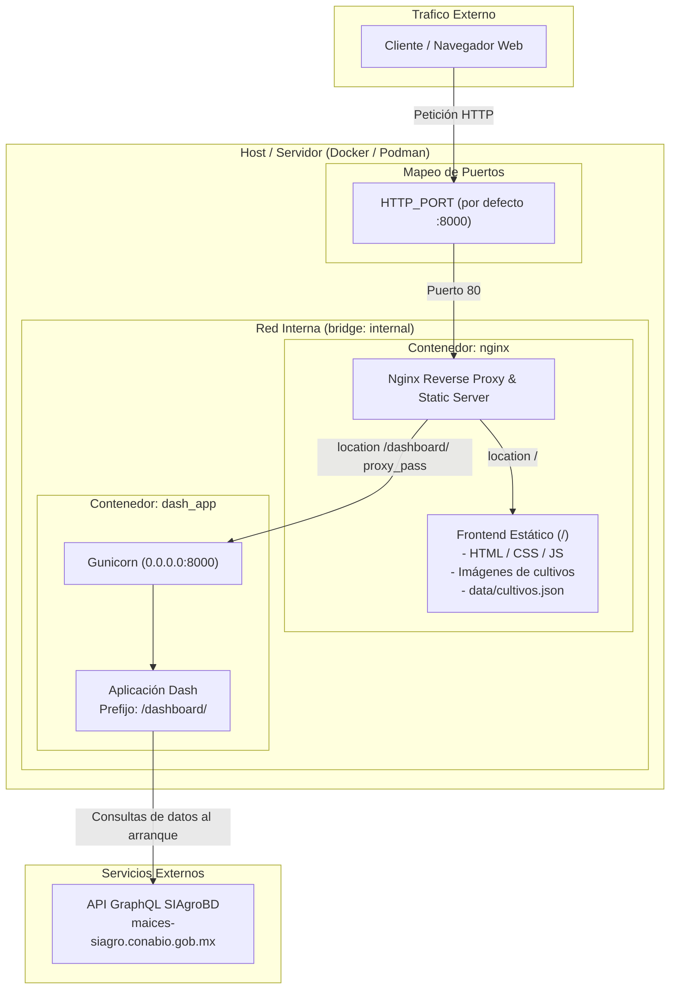

# 🌽 Aplicación Web de Climas y Agrobiodiversidad — CONABIO

El proyecto Agrobiodiversidad Mexicana, tiene como objetivo construir y fortalecer mecanismos que ayuden a conservar la agrobiodiversidad mexicana y los agroecosistemas tradicionales. Dentro de sus componentes está la consolidación del Sistema de Información sobre Agrobiodiversidad (SIAgroBD), el cual integra información sobre agrobiodiversidad. Como parte de la apertura de los datos del SIAgroBD a públicos diversos, teníamos la necesidad de realizar un mapa interactivo que mostrara datos acerca de características ambientales (precipitación, temperatura) de datos del SIAgroBD, particularmente de datos del Proyecto Global de Maíces Nativos de la CONABIO. Durante la estancia de estudiantes de la maestría de ciencia de datos del ITAM en Conabio, se desarrolló una aplicación web que cumplió a cabalidad con dichos requisitos.

Para el desarrollo de la aplicación, primero se realizó un taller con personas expertas en datos de maíz y trabajo con familias campesinas, donde se definieron las historias de usos y funcionalidades deseadas de la aplicación web. Con base en estos requisitos, se hizo una lista de requerimientos técnicos y una revisión de herramientas para cumplirlos. 

Este es un sitio híbrido para la exploración interactiva de condiciones climáticas (precipitación y temperatura media anual) de maíces nativos y teocintles en México, integrado con los datos del Sistema de Información sobre Agrobiodiversidad ([**SIAgroBD**](https://siagro.conabio.gob.mx/)) de la **CONABIO**.

---

## Arquitectura del Sistema

El proyecto opera como una arquitectura desacoplada basada en contenedores:

1. **Frontend Estático (`frontend/`)**: Sitio web principal desarrollado en HTML/CSS/JS que presenta información, galerías y catálogos de razas de maíces y teocintles. Es servido directamente por **Nginx** en la raíz (`/`).
2. **Dashboard Interactivo (`dashboard/`)**: Aplicación analítica interactiva desarrollada en **Python** con **Dash / Plotly** y ejecutada sobre **Gunicorn**. Se expone detrás del proxy inverso bajo el prefijo `/dashboard/`.
3. **Reverse Proxy Nginx (`nginx/`)**: Puerta de entrada única que unifica el frontend estático y el dashboard dinámico en un solo dominio y puerto, gestionando el enrutamiento y la entrega eficiente de assets.

### Diagrama de Arquitectura y Flujo de Tráfico



---

## Estructura del Repositorio

```
.
├── frontend/                 # Archivos estáticos (HTML, CSS, JS, imágenes de cultivos)
│   └── data/cultivos.json    # Manifiesto autogenerado durante el build
├── dashboard/                # Aplicación Dash / Plotly (Python 3.13)
│   ├── app.py                # Entrada principal y layout de la app Dash
│   ├── Dockerfile            # Construcción optimizada multi-stage con uv y gunicorn
│   ├── pyproject.toml        # Dependencias del proyecto
│   └── uv.lock               # Lockfile de dependencias gestionado con uv
├── nginx/                    # Configuración del servidor web y proxy
│   ├── nginx.conf            # Reglas de enrutamiento y proxy inverso
│   └── Dockerfile            # Build multi-stage (genera cultivos.json y copia frontend)
├── utils/                    # Scripts auxiliares
│   └── generate_cultivos_manifest.py  # Generador de catálogo de imágenes JSON
├── docker-compose.yml        # Orquestación de servicios (dash_app + nginx)
├── .env.example              # Plantilla de variables de entorno
└── README.md
```

---

## Despliegue y Ejecución con Contenedores

La forma recomendada de desarrollo y despliegue es utilizando contenedores mediante `docker-compose.yml`.

### 1. Configuración de Variables de Entorno

Copia el archivo de ejemplo y ajusta las variables según sea necesario:

```bash
cp .env.example .env
```

| Variable | Descripción | Valor por defecto |
| :--- | :--- | :--- |
| `HTTP_PORT` | Puerto en el host donde escuchará Nginx | `8000` |
| `STATIC_SITE_BASE_URL` | URL base del sitio estático para enlaces cruzados | `http://localhost:8000` |

### 2. Desarrollo Local (Podman)

En entornos de desarrollo local se recomienda utilizar `podman compose`:

```bash
# Construir imágenes y levantar servicios
podman compose up --build

# Para ejecutar en segundo plano
podman compose up --build -d

# Detener los contenedores
podman compose down
```

### 3. Producción (Docker)

En servidores de producción se utiliza `docker compose`:

```bash
# Construir y levantar en modo detached
docker compose up --build -d

# Consultar logs
docker compose logs -f

# Detener los contenedores
docker compose down
```

### 4. Acceso a la Aplicación

Una vez levantado el stack:
- **Sitio Principal (Frontend):** `http://localhost:8000/`
- **Mapa y Dashboard Interactivo:** `http://localhost:8000/dashboard/`

> [!NOTE]
> El contenedor `dash_app` no expone puertos directamente al host; la comunicación se realiza de forma segura a través de la red interna `internal` y es enrutada por `nginx`.

---

## 💻 Desarrollo Local sin Contenedores (Dashboard)

Si deseas trabajar únicamente en la aplicación Dash sin levantar el stack completo de contenedores:

### Requisitos
- **Python 3.13**
- [**uv**](https://github.com/astral-sh/uv) (gestor de paquetes y entornos virtuales de Python)

### Pasos

1. **Instalar dependencias y sincronizar el entorno:**
   ```bash
   cd dashboard
   uv sync
   ```

2. **Ejecutar el servidor de desarrollo:**
   ```bash
   uv run python app.py
   ```
   La aplicación estará disponible en `http://127.0.0.1:8050/dashboard/`.

3. **Variables de entorno para desarrollo:**
   - `PORT`: Puerto de escucha local (por defecto `8050`).
   - `HOST`: Host de enlace (por defecto `127.0.0.1`).
   - `DASH_DEBUG`: Activar/desactivar recarga en caliente (`True`/`False`).
   - `DASHBOARD_PATHNAME_PREFIX`: Prefijo de rutas (`/dashboard/`).

4. **Regenerar el catálogo de cultivos manualmente (opcional):**
   ```bash
   python utils/generate_cultivos_manifest.py
   ```

---

## Características Técnicas y Notas de Integración

- **Build Multi-Stage de Nginx:** La imagen de Nginx genera automáticamente el archivo `frontend/data/cultivos.json` a partir del catálogo de imágenes durante la etapa de construcción, eliminando la necesidad de versionarlo manualmente.
- **Resiliencia de Red y DNS:** Al arrancar, `app.py` realiza consultas a la API GraphQL de SIAgroBD (`https://maices-siagro.conabio.gob.mx/graphql`) con reintentos exponenciales y servidores DNS de respaldo (`1.1.1.1`, `8.8.8.8`) para garantizar estabilidad ante fluctuaciones de red.
- **Enrutamiento de Assets:** La aplicación Dash está configurada con `requests_pathname_prefix='/dashboard/'` y construcción dinámica de URLs mediante `app.get_asset_url(...)` para operar transparentemente detrás del reverse proxy.
